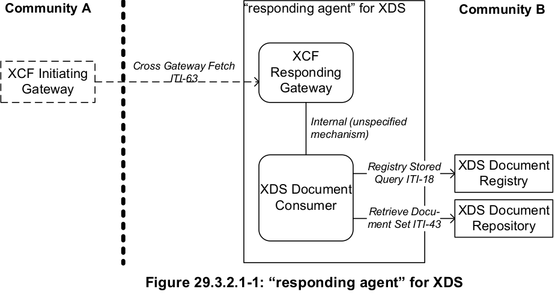
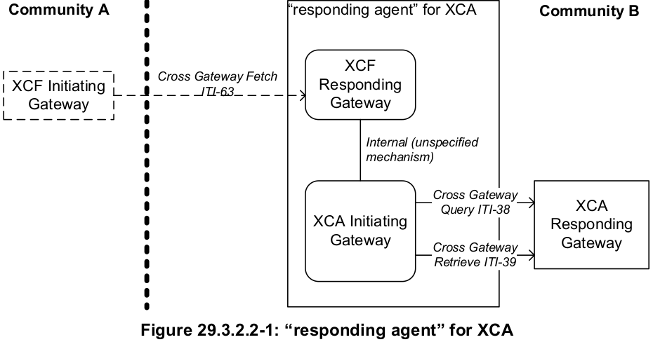
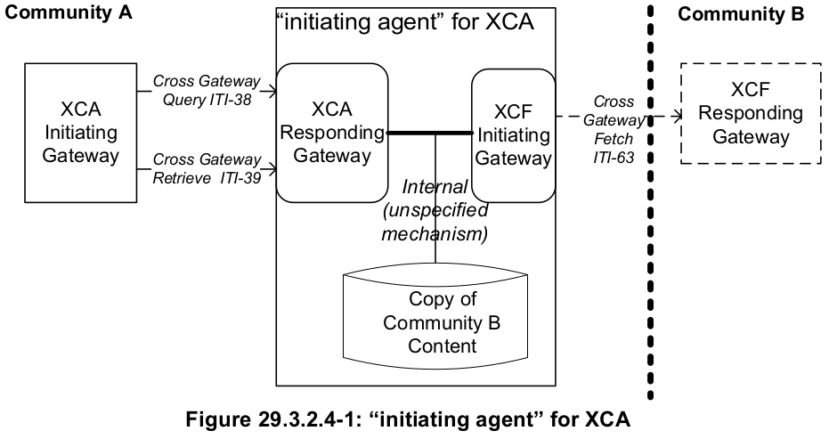
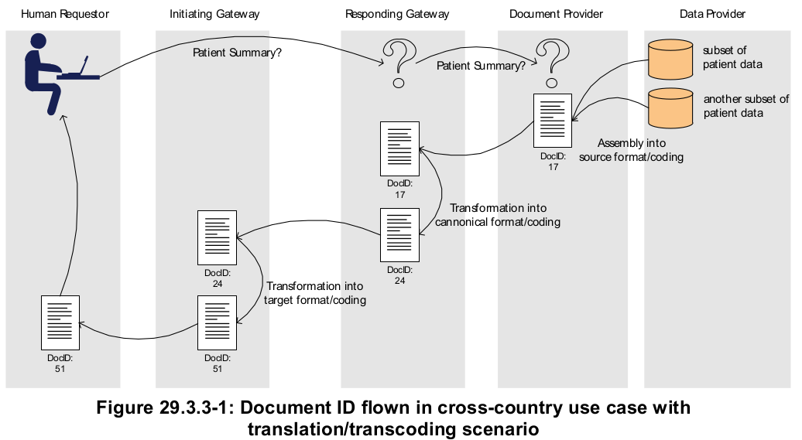

## Integrating the Healthcare Enterprise

# IHE IT Infrastructure<br/>Technical Framework Supplement<br/><br/>Cross-Community Fetch (XCF)<br/><br/>Rev. 1.5 – Trial Implementation

### Date: July 21, 2017<br/>Author: ITI Technical Committee<br/>Email: iti@ihe.net

#### *Please verify you have the most recent version of this document. See here for Trial Implementation and Final Text versions and here for Public Comment versions.*

#### *Copyright © 2016: IHE International, Inc.*

---
<!-- START doctoc generated TOC please keep comment here to allow auto update -->
<!-- DON'T EDIT THIS SECTION, INSTEAD RE-RUN doctoc TO UPDATE -->
### Table of Contents

  - [Integrating the Healthcare Enterprise](#integrating-the-healthcare-enterprise)
- [IHE IT Infrastructure<br/>Technical Framework Supplement<br/><br/>Cross-Community Fetch (XCF)<br/><br/>Rev. 1.5 – Trial Implementation](#ihe-it-infrastructurebrtechnical-framework-supplementbrbrcross-community-fetch-xcfbrbrrev-15--trial-implementation)
    - [Date: July 21, 2017<br/>Author: ITI Technical Committee<br/>Email: iti@ihe.net](#date-july-21-2017brauthor-iti-technical-committeebremail-itiihenet)
      - [*Please verify you have the most recent version of this document. See here for Trial Implementation and Final Text versions and here for Public Comment versions.*](#please-verify-you-have-the-most-recent-version-of-this-document-see-here-for-trial-implementation-and-final-text-versions-and-here-for-public-comment-versions)
      - [*Copyright © 2016: IHE International, Inc.*](#copyright-%C2%A9-2016-ihe-international-inc)
  - [Introduction](#introduction)
  - [Open Issues and Questions](#open-issues-and-questions)
- [Volume 1 – Profile](#volume-1--profile)
  - [29 Cross-Community Fetch (XCF) Profile](#29-cross-community-fetch-xcf-profile)
  - [29.1 Actors/Transactions](#291-actorstransactions)
  - [29.2 XCF Profile Options](#292-xcf-profile-options)
    - [29.2.1 Asynchronous Web Services Exchange Option](#2921-asynchronous-web-services-exchange-option)
  - [29.3 XCF Actor Groupings and Profile Interactions](#293-xcf-actor-groupings-and-profile-interactions)
    - [29.3.1 XCF Required Groupings](#2931-xcf-required-groupings)
    - [29.3.2 XDS/XCA Interactions (Informative)](#2932-xdsxca-interactions-informative)
    - [29.3.2.1 “responding agent” for XDS (Grouping with Document Consumer)](#29321-responding-agent-for-xds-grouping-with-document-consumer)
    - [29.3.2.2 “responding agent” for XCA](#29322-responding-agent-for-xca)
    - [29.3.2.2 “initiating agent” for XDS](#29322-initiating-agent-for-xds)
    - [29.3.2.4 “initiating agent” for XCA](#29324-initiating-agent-for-xca)
    - [29.3.3 Profile Interactions (Informative)](#2933-profile-interactions-informative)
    - [3.63.7 Sample Request Message (Informative)](#3637-sample-request-message-informative)

<!-- END doctoc generated TOC please keep comment here to allow auto update -->

---

## Introduction
The Cross-Community Fetch (XCF) Profile defines a single transaction for accessing medical data between gateways that facilitate multiple dimensions of communication (trust, semantics, encoding, legislation, authority, etc.). The profile is highly inspired by the Cross Gateway Query/Cross Gateway Retrieve transactions and integrates these originally distinct transactions.

In specific use cases, for example when a few dynamically created documents need to be accessed from interacting communities with centralized data localization, a single transaction (versus independent query and retrieve) may reduce the coordination and maintenance of the transactional dependencies and transaction states.

For such use cases, and in environments where stateless Responding Gateways can be designed, it simplifies the implementation of such Responding Gateways. However, it may increase the implementation complexity of Initiating Gateways serving some types of communities, such as XDS Affinity Domains. XCF offers a different deployment option from the general purpose XCA Profile.

## Open Issues and Questions
**XCF008**: This supplement introduces the concept of automated document transforms at the XCF Responding Gateway while not necessarily making the transformed document persistent. For patient safety and traceability reasons this aspect might need to be discussed further.

**XCF009**: The relationship/difference to on-demand should be provided.

---

# Volume 1 – Profile

## 29 Cross-Community Fetch (XCF) Profile
The Cross-Community Fetch (XCF) Profile defines a single transaction for accessing medical data between gateways that facilitate multiple dimensions of communication (trust, semantics, encoding, legislation, authority, etc.). The profile is highly inspired by the Cross Gateway Query/Cross Gateway Retrieve transactions.

In specific use cases, for example when a few dynamically created documents need to be accessed from interacting communities with centralized data localization; a single transaction (versus independent query and retrieve) may reduce the coordination and maintenance of the transactional dependencies and transaction states.

For such use cases, and in environments where stateless Responding Gateways can be designed, XCF simplifies the implementation of such Responding Gateways. However, it may increase the implementation complexity of Initiating Gateways serving some types of communities, such as XDS Affinity Domains. XCF offers a different deployment option from the general purpose XCA Profile.

The transaction fetches a small number of documents based upon a few retrieval parameters. This transaction is simplified to permit easier implementation and better performance on Responding Gateways.

Transcoding and translation of the documents and other data can be performed on the Responding Gateway as part of the transaction.

The XCF Profile stipulates that the following prerequisites are met:

* the document properties to be communicated are known in advance
* the result data sets can be characterized in advance
* the documents are feasible to be returned in a single response
* no further selection and/or manual interaction is needed in the communication process
* pre-conditions, such as purpose of use, legitimate data, and environment, are agreed upon in advance and are documented in a community or framework agreement
* the document fetching may not always be repeatable – it may not be assumed in every case that the same query with the same query parameters will return the same document  version with the same document id.

Ideally, only one document will satisfy the Fetch (e.g., only the most current instance of a patient summary is provided by the Responding Gateway). If the size of the set of documents matching the request is too large to be packed into a single response, an error code is returned by the Responding Gateway. The assumption is that the Cross-Community Access (XCA) Profile is used when requests are expected to return a large number of documents.

## 29.1 Actors/Transactions

Figure 29.1-1 shows the actors directly involved in the XCF Profile and the relevant transactions between them.


Table 29.1-1 lists the transactions for each actor directly involved in the XCF Profile. In order to claim support of this profile, an implementation must perform the required transactions (labeled “R”). Transactions labeled “O” are optional. A complete list of options defined by this profile and that implementations may choose to support is listed in Section 29.2.

Table 29.1-1: XCF Profile - Actors and Transactions

| Actors | Transactions | Optionality | Reference |
| :--- | :--- | :---: | :--- |
| Initiating Gateway  | Cross Gateway Fetch [ITI-63] | R | ITI TF-2b: 3.63 |
| Responding Gateway  | Cross Gateway Fetch [ITI-63] | R | ITI TF-2b: 3.63 |

## 29.2 XCF Profile Options

Options that may be selected for this profile are listed in the Table 29.2-1 along with the actors to which they apply. Dependencies between options when applicable are specified in notes.

Table 29.2-1: XCF - Actors and Options

| Actors | Options | Reference |
| :--- | :--- | :---: |
| Initiating Gateway  | Asynchronous Web Services Exchange | Section 29.2.1 |
| Responding Gateway  | No options defined | -- |

The Responding Gateways shall support Asynchronous Web Services Exchange Option on the Cross Gateway Fetch. Support for this function is required in order to enable use of Asynchronous Web Services Exchange in any cross-community interaction.

### 29.2.1 Asynchronous Web Services Exchange Option

Initiating Gateways which support Asynchronous Web Services Exchange shall support Asynchronous Web Services Exchange on the Cross Gateway Fetch [ITI-63] transaction.

## 29.3 XCF Actor Groupings and Profile Interactions

### 29.3.1 XCF Required Groupings

An actor from this profile (Column 1) shall implement all of the required transactions and/or content modules in this profile in addition to all of the transactions required for the grouped actor (Column 2).

If this is a content profile, and actors from this profile are grouped with actors from a workflow or transport profile, the Content Bindings reference column references any specifications for mapping data from the content module into data elements from the workflow or transport transactions.

Table 29.3.1-1: XCF - Required Actor Groupings

| XCF Actor | Actor to be grouped with | Reference | Content Bindings Reference |
| :--- | :--- | :---: | :--- |
| Initiating Gateway  | ATNA / Secure Node or Secure Application | ITI TF-1: 9 | -- |
|   | CT / Time Client | ITI TF-1: 7 | -- |
|   | XUA / X-Service User | ITI TF-1: 13 | -- |
| Responding Gateway  | ATNA / Secure Node or Secure Application | ITI TF-1: 9 | -- |
|   | CT / Time Client | ITI TF-1: 7 | -- |
|   | XUA / X-Service User | ITI TF-1: 13 | -- |

### 29.3.2 XDS/XCA Interactions (Informative)

Interoperable interaction between communities which have chosen to implement only XCF and those that are based on XDS or XCA may be enabled through transformation agents. IHE does not specify the mechanism used by such transformation agents or any details about their implementation. The following sections give a high level perspective on the challenges of enabling four cases of agents:

1. “responding agent” for XDS- acts as an XCF Responding Gateway and converts incoming Cross Gateway Fetch transactions into XDS transactions to collect the content needed for the response.
2. “responding agent” for XCA- acts as an XCF Responding Gateway and converts incoming Cross Gateway Fetch transactions into XCA transactions to collect the content needed for the response.
3. “initiating agent” for XDS – acts as an XCF Initiating Gateway and converts XDS transactions into Cross Gateway Fetch transactions to collect content from XCF only communities.
4. “initiating agent” for XCA– acts as an XCF Initiating Gateway and converts XCA transactions into Cross Gateway Fetch transactions to collect content from XCF only communities.

Some agents are relatively easy to implement and others are quite complicated. In environments where integration of with XCA and XDS is important it would be advisable to consider XCA with the On-Demand Documents Option as an alternative to the use of XCF.

### 29.3.2.1 “responding agent” for XDS (Grouping with Document Consumer)

A “responding agent” for XDS converts incoming Cross Gateway Fetch transactions into Registry Stored Query [ITI-18] and Retrieve Document Set [ITI-43] transactions which are directed to a local XDS Registry/Repository. This type of agent has value because it allows access by XCF only communities to content within XDS based communities.

A “responding agent” for XDS can be enabled through a relatively simple grouping of XDS Document Consumer and XCF Responding Gateway. The agent must convert the Cross Gateway Fetch query into a collection of Registry Stored Query and Retrieve Document Set transactions.
This conversion is relatively straightforward; the query in the Cross Gateway Fetch transaction maps closely to the Find Documents stored query of Registry Stored Query and from this query the agent can generate appropriate Retrieve Document Set transactions to get the document contents. Several additional details need to be managed by the agent, like supplying document associations and handling situations when the results are too large to be returned in the Cross Gateway Fetch response. Figure 29.3.2.1-1 depicts this environment.



### 29.3.2.2 “responding agent” for XCA

A “responding agent” for XCA converts incoming Cross Gateway Fetch transactions into Cross Gateway Query and Cross Gateway Retrieve transactions which are directed to a XCA Responding Gateway. This type of agent has value because it allows access by XCF only communities to content within XCA based communities.

A “responding agent” for XCA groups with an XCA Initiating Gateway in order to initiate Cross Gateway Query and Cross Gateway Retrieve transactions to a XCA Responding Gateway. The agent must convert the Cross Gateway Fetch query into an appropriate query supported by Cross Gateway Query and must interpret and collect the results of the Cross Gateway Query and Cross Gateway Retrieve in order to respond to the Cross Gateway Fetch transaction. The query mapping and translation across transactions is equivalent to the work involved in a “responding agent” for XDS. Figure 29.3.2.2-1 depicts this environment.



### 29.3.2.2 “initiating agent” for XDS

An “initiating agent” for XDS enables access by the significant number of products supporting the XDS Document Consumer to content within a community that only supports XCF. Without this kind of enablement EMR/EHR systems (and others) will be cut off from the content held by a community that chooses to support only XCF. Enabling this interaction is more difficult than the other direction and this section only skims the surface of the work involved.

The “initiating agent” for XDS must be able to convert the contents of Registry Stored Query [ITI-18] transactions into Cross Gateway Fetch transactions. Typically, this will involve the conversion of the Find Documents stored query. Along with copying all the parameters, the
“initiating agent” for XDS must also manage a few other aspects of the query request. Handling the response from the Cross Gateway Fetch transactions involves storing locally the parts not immediately requested by the XDS Document Consumer and returning only the parts that are appropriate. For example, the Cross Gateway Fetch transaction will return the documents
associated with the metadata. The “initiating agent” for XDS cannot return these documents in the Registry Stored Query transaction so must save them locally in order to be able to return them upon receipt of a Retrieve Document Set transaction. The local storage, called “Copy of Community B content” in the diagram, looks a little like an XDS Registry/Repository system managed and used by the “initiating agent” for XDS. This storage will also need to hold the
metadata returned in the Cross Gateway Fetch to respond to Registry Stored Query transactions that use stored queries other than Find Documents. The complete design of the “initiating agent” for XDS is a non-trivial task and not further described by IHE.


### 29.3.2.4 “initiating agent” for XCA

An “initiating agent” for XCA enables access by communities using a XCA Initiating Gateway to access content within a community that only supports XCF. Without this kind of enablement XCA communities will be cut off from the content held by a community that chooses to support only XCF. Enabling this interaction is very similar to the enablement for XDS. Figure 29.3.1.4-1
presents a view of how this enablement might be designed and represents the small differences from the “initiating agent” for XDS described in Section 29.3.2.4.



### 29.3.3 Profile Interactions (Informative)

Potential interactions for XCF with other IHE profiles are illustrated in this real world example.

It is assumed that a gateway infrastructure is set up for sharing patient’s medical summary data among autonomous regions. Each region collects a different set of data for its patients and makes use of its own document schema and builds upon its specific taxonomies for coding values.
Patients may define privacy policies for their data and give general consent for data sharing in their region of affiliation while healthcare professionals are authenticated in the region of care.
Gateways perform all the transcoding, trust brokerage and access control enforcement such that all the (technical) complexity of this use case is hidden from the existing regional infrastructures and the acting persons.
As a result of this hidden complexity, from the physician’s perspective this use case is just a single operation: retrieval of an identified patient’s medical summary.

Organizationally, the concrete service delivery steps may be assigned to existing relevant IHE profiles for partial task fulfillment.

| Service Delivery Step | Support provided by IHE Profiles |
| :--- | :--- |
| Claim about requestor authenticity  | Initiating gateway grouped with IHE XUA X-Service-User Responding gateway grouped with IHE XUA X-Service-Provider |
| Provisioning of requestor identity attributes (local roles,
permissions, treatment context, delegation) | **IHE XUA** attributes |
| Establishing and Verifying Trust Relationships between
the initiating and responding gateways | Deployment of the gateways as **IHE ATNA** Secure Nodes |
| Establishing an Audit Trail for traceability between initiating and responding gateway | **IHE ATNA** Audit Trail |
| Verification of the patient’s privacy consent | **IHE BPPC** encoded consents accessed through **IHE XDS** transactions. |
| Assurance of health information integrity and originator authenticity | **IHE DSG** for document digital signatures |
| Policy Decision and Policy Enforcement at each of the gateways | Policy Decision and Policy Enforcement (IHE White Paper on Access Control) |
| Health Information Exchange with opaque regional infrastructures | May be implemented by IHE XDS or other Entity Services à intentionally opaque |
| Canonical encoding of patient summary document for sharing information among autonomous regions | e.g., IHE PCC XDS-MS (Medical Summary Document Content) as content model |

The translation and transcoding of patient summary data from a regional encoding into the canonical encoding at the Responding Gateway and the reverse transformation at the Initiating Gateway are out of the scope of IHE and subject to individual implementation (even though profiles like IHE SVS can help with the management of value sets). The Figure 29.3.3-1 shows the respective document transformations, which require ( from the consumer’s perspective ) at least two intermediary documents.



### 3.63.7 Sample Request Message (Informative)

``` xml
<soapenv:Envelope
    xmlns:soapenv="http://schemas.xmlsoap.org/soap/envelope/">
    <soapenv:Header> ... </soapenv:Header>
    <soapenv:Body>
        <query:AdhocQueryRequest>
            <query:ResponseOption returnComposedObjects="true" returnType="LeafClassWithRepositoryItem"/>
            <rim:AdhocQuery id="urn:uuid:f2072993-9478-41df-a603-8f016706efe8"
home=”2.16.17.710.780.1000.990.1”>
                <rim:Slot name="$XDSDocumentEntryPatientId">
                    <rim:ValueList>
                        <rim:Value>
                            ‘AT12998493069126^^^&amp;2.16.17.710.780.1000.990.1&amp;ISO’
                        </rim:Value>
                    </rim:ValueList>
                </rim:Slot>
                <rim:Slot name="$XDSDocumentEntryStatus">
                    <rim:ValueList>
                        <rim:Value>
                            ('urn:oasis:names:tc:ebxml-regrep:StatusType:Approved')
                        </rim:Value>
                    </rim:ValueList>
                </rim:Slot>
                <rim:Slot name="$XDSDocumentEntryClassCode">
                    <rim:ValueList>
                        <rim:Value>
                            ('57833-6^^2.16.840.1.113883.6.1')
                        </rim:Value>
                    </rim:ValueList>
                </rim:Slot>
            </rim:AdhocQuery>
        </query:AdhocQueryRequest>
    </soapenv:Body>
</soapenv:Envelope>
```
